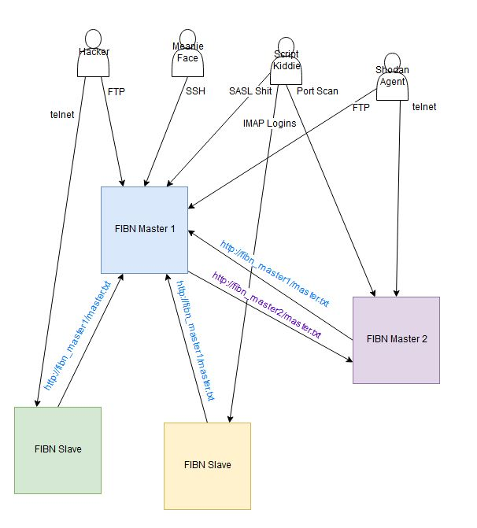

<link rel="stylesheet" type="text/css" href="css/github.css">

<h1 align="center">
  
</h1>

--------------------------------------------

<h1 align="center">
  
</h1>

--------------------------------------------

# FIBN (Firewall Ipset Blacklist Network)
by Raymond Spangle

---------------------------------------------

### History:
- - - - - - 

FIBN is the next generation of my BlockIPSet tool (https://github.com/lleevveell66/BlockIPSet).  FIBN uses the newer 
firewalld instead of iptables (though implementation of iptables support should not be difficult and is planned soon.)  
FIBN also expands the idea to be a networked solution, where every host can inform other hosts about malicious IP
addresses is has had to block.

### Theory of Operation:
- - - - - - - - - - 

FIBN will automatically block malicious IP addresses, once every minute.  Doing this can be considered a "bad idea" by 
some, since it can open you up to DoS attacks.  If they learn where the triggers are, they could spoof from your default 
gateway, for instance.  The capability to whitelist has been included to help minimize this risk.  Obviously, not bragging 
about running it will help, as well.   This is an example of when a little "security-through-obscurity" sprinkled into 
your blue teaming is actually a "good idea".  You are ultimately responsible for proper configuration and use of this 
tool, and any damage doing so may lead to.

FIBN will compile a total list of IPs to block from three sources:
- A Master Blacklist, kept somewhere on a web server
- A Local Blacklist, generated each run on the local machine
- A Manual Blacklist, generated by hand on the local machine

FIBN will then remove any IPs from this list which are whitelisted, build an ipset, and insert that ipset into
firewalld or iptables.  If the host you are running FIBN on is considered the "Master", then a new Master Blacklist
will also be created and placed in the web directories so other instances can download it.

It is not difficult to see how this could easily be massaged into a sort of mesh network, where every host is its
own Master and Slave to another.  Multiple URLs are not yet supported, but are planned for a future release, thus 
allowing a true FIBN mesh network, where every host could potentially instruct every other host about malicious IP
addresses it has found locally.

Taking the above diagram as an example, the Hacker entity will trigger blacklisting on FIBN Master 1 by attempting to 
FTP, as well as on FIBN Slave 1 (the green one) by attempting to telnet.  But, because the list is also retreived remotely 
from FIBN Master 1 by FIBN Master 2 and FIBN Slave 2 (the yellow one), all four hosts will now block the Hacker entity's 
IP address.

You can define your own malicious behavior any way you like by editing the fibn_BuildLocal script.  All that matters is that 
your matches are taken down into IP addresses only, then appended to the $TMPFILE .  Several examples are included.

All configuration is in /etc/fibn/ after installation.  The /etc/fibn/fibn.conf file defines whether or not this is a master,
where the master list can be found, and some file locations.  /etc/fibn/ also contains all of the local lists:

- /etc/fibn/local.txt
- /etc/fibn/manual.txt
- /etc/fibn/master.txt
- /etc/fbin/whitelist.txt

Every local list build (once per minute, if you use the cron jobs given below) all malicious IP addresses are aggregated, 
then any IP address in the whitelist.txt file is removed.  This is then passed into an ipset for firewalld to block what is 
left.

Only firewalld is supported, for now.  I have ipset working in iptables, but not yet integrated into FIBN.  That's coming.


### Pre-requisites:
- - - - - - - -

- python
- firewalld (iptables will be supported in the near future)
- ipset


### Installation:
- - - - - - -

1) Make a super syslog, with:
```
echo "*.* /var/log/all_messages">>/etc/rsyslog.conf
service rsyslog restart
```
(NOTE: You can skip this step if you don't like it.  It could be troublesome on smaller devices with limited space 
and improper log rotation configured, for example.  But, if you skip this, make sure to edit the fibn_BuildLocal 
script to change how you gather local malicious IP addresses.  Mine all come out of /var/log/all_messages)

2) `cat install.sh # because you always audit code from GitHub, right?`
3) `./install.sh`
4) If this is a master, edit /etc/fibn/fibn.conf and change MASTER=1 then make sure the MASTERBLACKLIST file location is correct.
This is where a master will drop its list for pickup via the web from other masters and slaves.  The value is ignored if
this host is configured as a slave.
5) Edit /etc/fibn/fibn.conf and make sure the MASTERURL location is correct.  This is the URL where this host will grab a 
master list from, no matter if it is master or slave.
6) Build any of the rich rules for logging hits to ports people should not be hitting.  For example, if you have moved SSH
off of port 22, do not run an FTP daemon, and do not allow telnet, you would run this:

```
firewall-cmd --permanent --zone=public --add-rich-rule="rule family="ipv4" port protocol="tcp" port="21" log prefix="firewalld-port-attempt" level="info" accept"
firewall-cmd --permanent --zone=public --add-rich-rule="rule family="ipv4" port protocol="tcp" port="22" log prefix="firewalld-port-attempt" level="info" accept"
firewall-cmd --permanent --zone=public --add-rich-rule="rule family="ipv4" port protocol="tcp" port="23" log prefix="firewalld-port-attempt" level="info" accept"
firewall-cmd --reload
```
All that is important is that the prefix is "firewalld-port-attempt" for now.  You can always choose your own prefix and edit the
fibn_BuildLocal script to look for those, later.

7) Make sure everything works, with:

```
fibn_BuildLocal
fibn_Apply
fibn_Stats
tail /var/log/all_messages
```

Make sure you see a line similar to:

> Dec 19 08:00:01 freemail FIBN: Blacklisted IP Addresses: 547

8) `crontab -e` and add the following:

```
# * * * * * command to be executed
# - - - - -
# | | | | |
# | | | | +----- day of week (0 - 6) (Sunday=0)
# | | | +------- month (1 - 12)
# | | +--------- day of month (1 - 31)
# | +----------- hour (0 - 23)
# +------------- min (0 - 59)

* * * * * /usr/local/bin/fibn_BuildLocal && /usr/local/bin/fibn_Apply
0 * * * * /usr/local/bin/fibn_Stats
```

9) Manually edit /etc/fibn/local.txt to add any malicious IP addresses you find, manually
10) Manually edit /etc/fibn/whitelist.txt to whitelist any more important IP addresses you need (multiple gateways, DNS, etc.)


